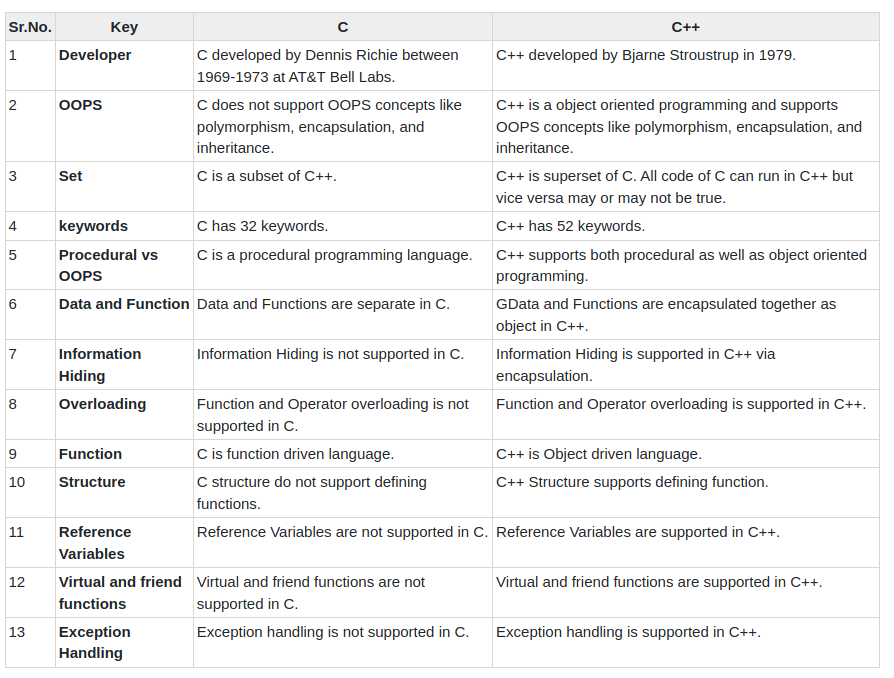
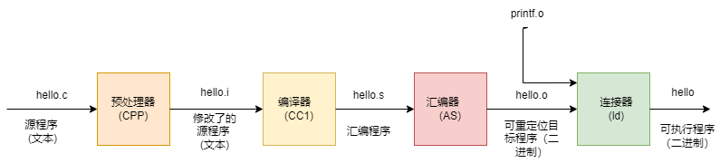
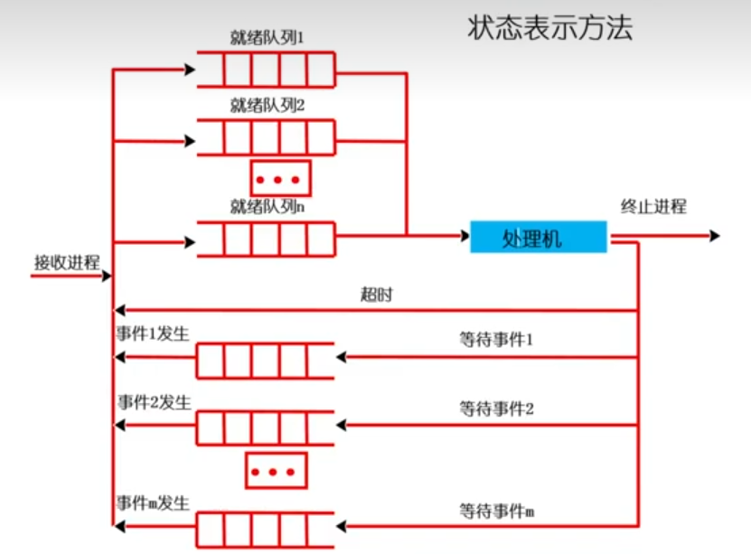
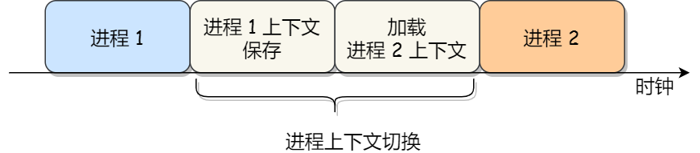
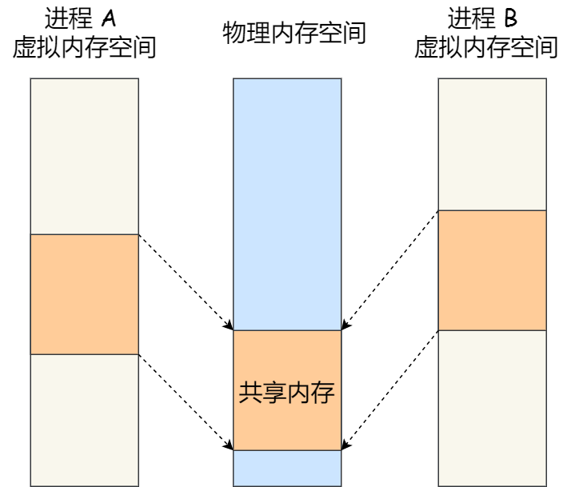
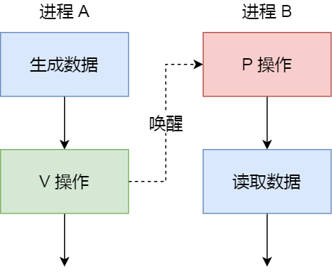
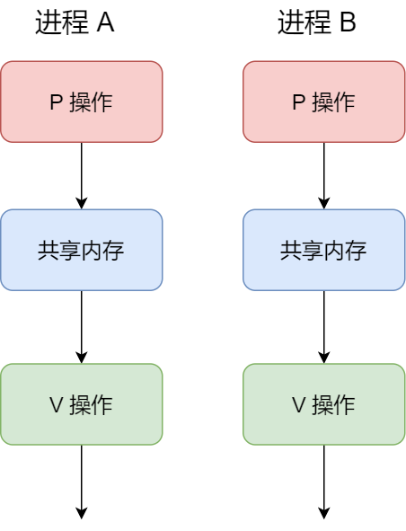
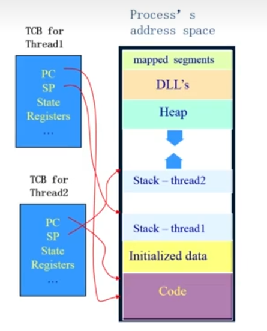

# C与C++

这是一个需要思考的问题，虽然都说语言不重要，但是不同的语言却可以让我们思考不同的编程结构和编程风格。我想如果我能够了解更多不同的C和C++开源项目，并且从效率问题、规范问题、逻辑问题去分析它们的不同，那么我对C和C++的不同就会有更深刻的理解。

此时此刻的理解：

**C语言：**

C语言是面向过程的，我的理解是C语言是将数据和方法分开定义，然后将数据和方法形成一个逻辑过程；但我同时觉得C语言是可以基于对象编程的，这是因为函数指针的存在，可以让struct中不仅存在数据，也存在通过函数指针调用的方法。C语言的编程结构是一层一层往上写，先写底层硬件层，在写驱动层，最后写任务层。

**C++语言：**

C++是面向对象的，其主要特质是继承和多态。C++一块一块的写，如果它分层的话，应该是使用继承，基类作为底层。这样写的好处就是便于维护。

除了自己的理解，从一些细小的细节上看一下两种语言的区别：



# 基础知识点

## "通道"概念，协程，任务，线程，进程

1.任务和线程之间是可以画为等价的，任务是在RTOS中，线程是在通用操作系统中。

2.线程和进程之前区别：线程使用的都是同一块虚拟地址，进程之间的虚拟地址不一样。

## new的使用

```c++
int *a = new int(10);//创建一个int
int * a = new int[10];//创建一个数组
```

## new和malloc

可以new然后free吗

## nullptr和NULL

在C++中应该使用nullptr表示指针语义，而不应该使用NULL，应该NULL在C++仅表示为0

```c++
//stddef.h头文件中定义如下：
#undef NULL
#if defined(__cplusplus)
#define NULL 0
#else
#define NULL ((void *)0)
#endif
//之所以这样定义，是因为在C++中不能将void*隐式转换为其他指针类型，例子：
#include<iostream>
int main(void)
{
    char p[] = "12345";
    int *a = (void*)p;//编译出错
    return 0;
}
//使用nullptr的好处就是，在函数重载时不会产生二义性；使用NULL的话，可能会把它视为int类型
```

总之，在C++中如果表示空指针，那么使用nullptr而不是NULL。

## 左值和右值

右值：当一个对象被用作右值的时候，用的是对象的值（内容）。

左值：当对象被用作左值的时候，用的是对象的身份（在内存中的位置）。

## 函数指针数组

```c++
#include <iostream>
using namespace std;

int b = 0;
int *(*a[2])(int);//a是个数组,数组中元素指向的是一个函数

int* f(int a)
{
    return &b;
}

int main()
{
    a[0] = f;
    a[1] = nullptr;
    cout << (int *)f <<endl;
    cout << (int *)a[0] <<endl;
    cout << endl;
    cout << (int *)&b <<endl;
    cout << a[0](0) <<endl;
    // int a[] = "1234";
}
```

## 智能指针

智能指针是为了解决动态内存分配时带来的内存泄露以及多次释放同一块内存空间而提出的。

### unique_ptr

特点：一个资源只能由一个指针独占，不可以拷贝构造，不可以赋值。但可以进行移动构造和移动赋值move()。

```c++
#include <iostream>
using namespace std;
#include <memory>
struct Node;
using NodePtr = unique_ptr<Node> ;

struct Node{
    int value;
    NodePtr left;
    NodePtr right;
    Node(){};
    Node(int _val) : value(_val) {};
    Node(int _val, NodePtr _left, NodePtr _right) {
        value = _val;
        left = move(_left);
        right = move(_right);
    };
};

int main(){
    auto my_head = new Node(1);
    NodePtr sp_head(new Node(2));
    NodePtr sp_left_son(new Node(3));
    NodePtr sp_right_son(new Node(4));
    sp_head->left = move(sp_left_son);
    // sp_head->left = sp_left_son; //编译不通过，因为资源智能被一个指针占有，所以只能移动拷贝。
    sp_head->right = move(sp_right_son);

    cout << my_head->value << " " << sp_head->value<<endl;
    cout << sp_head->left->value << " " << sp_head->right->value << endl;
    
    delete my_head;
    my_head = nullptr;//智能指针的好处就是不用手动释放空间
	return 0;
}

```

### shared_ptr

特点：资源可以被多个指针共享，但是多个指针指向同一个资源不能被释放多次，因此使用计数机制表明资源被几个指针共享。

```c++
#include <iostream>
using namespace std;
#include <memory>
struct Node;
using NodePtr = shared_ptr<Node>;

struct Node{
    int value;
    NodePtr next;
    Node(){};
    Node(int _val) : value(_val) {};
    Node(int _val, NodePtr _next) : value(_val), next(_next) {};
};

int main()
{
    NodePtr head(new Node(100));
    NodePtr dummy(new Node(1, head));//虚拟节点
    // dummy->next = head;
    cout << head.use_count() << endl;//看一下资源被几个指针共享
}
```

### weak_ptr

特点：解决shared_ptr的循环引用问题而提出的。

### 智能指针创建


## lambda表达式/函数

**介绍**：The type of a lambda is an **anonymous function object**(or functor) that is unique for each lambda expression. Thus, to declare objects of that type, you need **templates** or **auto**. If you need the type, you can use **decltype()**, which is, for example, required to pass a lambda as hash function or ordering or sorting criterion to associative or unordered containers.

**优点**：inline functionality，原地开始写函数，不需要调用外部定义的函数

**作用**：STL function object -> lambda

**标准表达式**：$[\cdots](\cdots)\quad mutable_{opt}\quad throwSpec_{opt}\quad \rightarrow retType_{opt}\{\cdots\}$

+ $[\cdots]$：
  + lambda introducer. 导入符号，看到它就知道是lambda表达式
  + capture to access nonstatic outside objects inside the lambda. Static objects such as std::cout can be used. 
  + you can specify a capture to access data of outer scope that is not passed as an argument:
    + $[=]$：means that the outer scope is passed to the lambda **by value**.
    + $[\&]$：means that the outer scope is passed to the lambda **by reference**.

+ $(\cdots)$：函数参数。可以不写，但是如果后面三个可选的参数只要出现一个，就必须有它。

+ $\{\cdots\}$：函数体

+ $mutable$：决定了$[\cdots]$中的数据是否可以被改写
+ $throwSpec$：函数抛出异常，不知道怎么用
+ $retType$：尾置函数返回类型，因为书写关系，它只能放在最后面

**实例**：

```c++
//实例1
//建立一个对象，它是临时的
[]{
	cout << "hello lambda" << endl;
};
//建立一个对象，它赋给了l
auto l = []{
    cout << "hello lambad" << endl;
};
//调用建立的对象
l();
```

```c++
//实例2
int id = 0;
//没有mutable,id是不允许更改的
auto f = [id]()mutable{
    cout << "id:" << id << endl;
    ++id;
};

id = 42;
f();//id:0
f();//id:1
f();//id:2
cout << id << endl;
```

```c++
//实例3
auto cmp = [](const Person &p1, const Person &p2){
    return p1.lastname() < p2.lastname() ||
        (p1.lastname() == p2.lastname() && 
        p1.firstname() < p2.firstname());
};
//使用decltype传lambda的类型，传入cmp为了改变set的构造函数
set<Person, decltype(cmp)> coll(cmp);
```

```c++
//实例4
vector<int> vals;
//使用lambda代替function object又称为仿函数（functor）
sort(vals.begin(), vals.end(),[&](int a, int b){
    return a > b;
});
```


## 编译



### 动态链接和静态链接

+ **静态链接**：
  + 定义：代码在生成可执行文件时，将该程序所需要的全部外部调用函数全部拷贝到最终的可执行程序文件中，在该程序被执行时，该程序运行时所需要的全部代码都会被装入到该进程的虚拟地址空间中。
  + 优点：运行速度快。
  + 缺点：生成的可执行文件比较大，浪费硬盘；并且内存中有多个副本，浪费内存空间；更新困难，每次更新都需要重新编译。
+ **动态链接**：
  + 定义：代码在生成可执行文件时，将部分调用的程序放入到动态链接库或者共享对象的某个文件夹中，链接程序只是在最终生成的可执行程序中记录了共享对象的名字等一些信息，最有生成的ELF文件中并不包含这些调用程序二进制指令。在程序执行时，当调用到这部分程序时，操作系统会从动态链接库或者共享对象中加载，并将全部内容映射到该进程运行的虚拟地址空间中。
  + 优点：生成的可执行文件小，节省硬盘和内存；更新方便，只需要修改动态库就可以。
  + 缺点：动态库每次运行都需要链接，所以相比静态库有一定性能损失。


# STL及库函数

## 大小写字母转换

两个库函数

```c++
toupper()
tolower()
```

## push_back()和emplace_back()

c++开发中我们会经常用到插入操作对STL的各种容器进行操作，比如vector,map,set等。在引入右值引用，转移构造函数，转移复制运算符之前，通常使用push_back()向容器中加入一个右值元素(临时对象)时，==首先会调用构造函数构造这个临时对象，然后需要调用拷贝构造函数将这个临时对象放入容器中==。原来的临时变量释放。这样造成的问题就是临时变量申请资源的浪费。 
引入了右值引用，转移构造函数后，push_back()右值时就会调用构造函数和转移构造函数,==如果可以在插入的时候直接构造，就只需要构造一次即可==。这就是c++11 新加的emplace_back()。

```c++
#include <vector>  
#include <string>  
#include <iostream>  
 
struct President  
{  
    std::string name;  
    std::string country;  
    int year;  
 
    President(std::string p_name, std::string p_country, int p_year)  
        : name(std::move(p_name)), country(std::move(p_country)), year(p_year)  
    {  
        std::cout << "I am being constructed.\n";  
    }
    President(const President& other)
        : name(std::move(other.name)), country(std::move(other.country)), year(other.year)
    {
        std::cout << "I am being copy constructed.\n";
    }
    President(President&& other)  
        : name(std::move(other.name)), country(std::move(other.country)), year(other.year)  
    {  
        std::cout << "I am being moved.\n";  
    }  
    President& operator=(const President& other);  
};  
 
int main()  
{  
    std::vector<President> elections;  
    std::cout << "emplace_back:\n";  
    elections.emplace_back("Nelson Mandela", "South Africa", 1994); //没有类的创建  
 
    std::vector<President> reElections;  
    std::cout << "\npush_back:\n";  
    reElections.push_back(President("Franklin Delano Roosevelt", "the USA", 1936));  
 
    std::cout << "\nContents:\n";  
    for (President const& president: elections) {  
       std::cout << president.name << " was elected president of "  
            << president.country << " in " << president.year << ".\n";  
    }  
    for (President const& president: reElections) {  
        std::cout << president.name << " was re-elected president of "  
            << president.country << " in " << president.year << ".\n";  
    }
}
```

## std::move()

std::move是将对象的状态或者所有权从一个对象转移到另一个对象，只是转移，没有内存的搬迁或者内存拷贝。

std::move并不能移动任何东西，它唯一的功能是将一个==左值强制转化为右值引用==，继而可以通过右值引用使用该值，以用于移动语义。从实现上讲，std::move基本等同于一个类型转换：static_cast<T&&>(lvalue);
C++ 标准库使用比如vector::push_back 等这类函数时,会对参数的对象进行复制,连数据也会复制.这就会造成对象内存的额外创建, 本来原意是想把参数push_back进去就行了,通过std::move，可以避免不必要的拷贝操作。

```c++
#include <iostream>
#include <utility>
#include <vector>
#include <string>
int main()
{
    std::string str = "Hello";
    std::vector<std::string> v;
    //调用常规的拷贝构造函数，新建字符数组，拷贝数据
    v.push_back(str);
    std::cout << "After copy, str is \"" << str << "\"\n";
    //调用移动构造函数，掏空str，掏空后，最好不要使用str
    v.push_back(std::move(str));
    std::cout << "After move, str is \"" << str << "\"\n";
    std::cout << "The contents of the vector are \"" << v[0]
                                         << "\", \"" << v[1] << "\"\n";
}
```

## cout输出十六进制数字

```c++
cout << hex << a <<endl;
```

## int $\Leftrightarrow$string

```c++
//int变为string
int x;
string s = to_string(x);

//string变为int
string item;
int temp = stoi(item);
```

## vector中的最大值

```c++
int myints[] = {3,7,2,5,6,4,9};
auto max_it = max_element(myints.begin(), myints.end());//返回的是最大元素的迭代器
int index= max_it - myints.begin();//得到最大元素的下标
int max_num = myints[index];//得到最大元素
```

## 关于hash容器for循环遍历和删除

```c++
//1.hash在for循环中删除的操作
for(auto it = hash.begin(); it != hash.end();)
{
    it->second --;
    if(it->second <= 0) hash.erase(it++);
    else it++;
}
//2.hash的遍历操作
for(auto &kv : hash)//引用传递遍历
{
    cout<<kv.first<<kv.second<<endl;
}
for(auto &[k,v]:map)//结构化绑定，C++17新特性
{
	cout<<k<<v<<endl;
}
```

## 优先队列（小根堆）自定义比较

```c++
//优先队列使用的结构体比较，而不是函数
struct Cmp{
    bool operator() (ListNode* l1, ListNode *l2)
    {
        return l1->val > l2->val;      
    }
};
priority_queue<ListNode*,vector<ListNode*>, Cmp> heap;
```

## cout精度

```c++
#include <iostream>
#include <iomanip>
using namespace std;
int main()
{
	float a;
	cin>>a;
    printf("%0.5f",a);//小数点后5位
    cout<<setprecision(2)<<a;//有效数字2位
	cout<<fixed<<setprecision(5)<<a;//小数点后5位
}
```

## sizeof(vector <type>)

```c++
pointer _M_start;
pointer _M_finish;
pointer _M_end_of_storage;
```

## vector复制vector

````c++
//方法一
vector<int> first;
vector<int> second;
swap(first,second);//通过交换来复制
//方法二
second.assign(first.begin(),first.end());
````

## string复制string

```c++
ans = s.substr(pos,size);//pos:下标，不是迭代器。 size：要复制的子串的数量
```

## std::function()

function是一个template，定义于头文件functional中。通过function<int(int, int)> 声明一个function类型，它是“接受两个int参数、返回一个int类型”的可调用对象，这里可调用对象可以理解为函数指针（指针指向一个函数，该函数有两个int类型参数，返回int类型，即：int (*p)(int, int) ）。

可调用对象：对于一个对象或表达式，如果可以对其使用调用运算符()，则称该对象或表达式为可调用对象。

C++语言中有几种可调用对象：函数、函数指针、lambda表达式、bind创建的对象以及重载了函数调用运算符的类。

实例：

```c++
#include <functional>
#include <iostream>
using namespace std;
 
std::function< int(int)> Functional;
 
// 普通函数
int TestFunc(int a)
{
    return a;
}
 
// Lambda表达式
auto lambda = [](int a)->int{ return a; };
 
// 仿函数(functor)
class Functor
{
public:
    int operator()(int a)
    {
        return a;
    }
};
 
// 1.类成员函数
// 2.类静态函数
class TestClass
{
public:
    int ClassMember(int a) { return a; }
    static int StaticMember(int a) { return a; }
};
 
int main()
{
    // 普通函数
    Functional = TestFunc;
    int result = Functional(10);
    cout << "普通函数："<< result << endl;
 
    // Lambda表达式
    Functional = lambda;
    result = Functional(20);
    cout << "Lambda表达式："<< result << endl;
 
    // 仿函数
    Functor testFunctor;
    Functional = testFunctor;
    result = Functional(30);
    cout << "仿函数："<< result << endl;
 
    // 类成员函数
    TestClass testObj;
    Functional = std::bind(&TestClass::ClassMember, testObj, std::placeholders::_1);
    result = Functional(40);
    cout << "类成员函数："<< result << endl;
 
    // 类静态函数
    Functional = TestClass::StaticMember;
    result = Functional(50);
    cout << "类静态函数："<< result << endl;
 
    return 0;
}
```

## 哈希表

```c++
#include <iostream>
#include <unordered_map>
#include <vector>
using namespace std;
typedef pair<int, int> PII;
int main()
{
    unordered_map<int, vector<PII>> hash;
    vector<vector<int>> board = {
        {4,1,3},
        {1,2,5},
        {7,6,2}
    };
    //cout << board.size() << " " << board[0].size() <<endl;
    for(int i = 0; i < board.size(); ++i) {
        for(int j = 0; j < board[0].size(); ++j) {
            PII temp = {i,j};
            hash[board[i][j]].emplace_back(temp);
        }
    }
    for(auto x : hash) {
        cout << x.first <<endl;
        for(int i = 0; i < x.second.size(); ++i) {
            cout << x.second[i].first<< " " << x.second[i].second<<endl;
        }
    }
}
```


## 字符串操作

```c
// c
char s[100];
fgets(s, 100, stdin); //读入一行
// c++
string str;
getline(cin, str);
```

# 面向对象---类

## 虚函数表

虚表是一个**函数指针数组**，数组里存放的是函数指针，指向虚函数所在的位置。

对象调用虚函数时，会根据虚函数指针找到虚表的位置，再根据虚函数声明的顺序找到虚函数在数组的哪个位置，找到虚函数的地址，从而调用虚函数。==虚函数表和类绑定，虚表指针和对象绑定。==

## 构造函数和析构函数

### 移动构造


## 动态类型和静态类型

1.[动态类型和静态类型](https://blog.csdn.net/qq_26849233/article/details/74936925)

2.<<C++  primer>> 534页

## 继承和(纯)虚函数

基类就是把通用的功能给写好了，派生类就是写具有个性的功能。比如先写一个通用的固定翼控制器，然后再根据弹射起飞、滑行起飞等个性再写功能。以上用法就是设计模式中的Template Method。

**虚函数**：基类希望派生类能够重新定义（override，覆盖）它，且你对它有默认的定义

**纯虚函数**：基类希望派生类一定要重新定义（override，覆盖）它，你对它没有默认的定义

## 多态

+ **多态意义**：==一个接口，多种实现==。比如多个被控对象都使用PID，但是可能有的需要积分饱和，有的不需要，这样就写一个PID接口，但是对这个接口可以写多个函数实现。
+ **静态多态**：函数重载和运算符重载属于静态多态，复用函数名。这个过程是在编译阶段进行匹配的（类型检查等），也就是说在编译阶段就能够决定某个问题。
+ **动态多态**：
  + 本质：指针或引用的静态类型与动态类型不同这一事实正是C++语言支持多态性的根本所在。
  + 当基类指针指向派生类对象时，使用该指针访问一个基类和派生类都定义的虚函数，就会调用派生类虚函数。
+ 静态多态和动态多态区别：
  + 静态多态的函数地址是早绑定---编译阶段确定函数地址
  + 动态多态的函数地址是晚绑定---运行阶段确定函数地址

普通实现和多态实现对比，可以看出多态的优点：

```c++
/******************普通实现******************/
class Calculator {
public:
	int getResult(string oper)
	{
		if (oper == "+") {
			return m_Num1 + m_Num2;
		}
		else if (oper == "-") {
			return m_Num1 - m_Num2;
		}
		else if (oper == "*") {
			return m_Num1 * m_Num2;
		}
		//如果要提供新的运算，需要修改源码
	}
public:
	int m_Num1;
	int m_Num2;
};

void test01()
{
	//普通实现测试
	Calculator c;
	c.m_Num1 = 10;
	c.m_Num2 = 10;
	cout << c.m_Num1 << " + " << c.m_Num2 << " = " << c.getResult("+") << endl;

	cout << c.m_Num1 << " - " << c.m_Num2 << " = " << c.getResult("-") << endl;

	cout << c.m_Num1 << " * " << c.m_Num2 << " = " << c.getResult("*") << endl;
}


/******************多态实现******************/
//抽象计算器类
//多态优点：代码组织结构清晰，可读性强，利于前期和后期的扩展以及维护
class AbstractCalculator
{
public :

	virtual int getResult()
	{
		return 0;
	}

	int m_Num1;
	int m_Num2;
};

//加法计算器
class AddCalculator :public AbstractCalculator
{
public:
	int getResult()
	{
		return m_Num1 + m_Num2;
	}
};

//减法计算器
class SubCalculator :public AbstractCalculator
{
public:
	int getResult()
	{
		return m_Num1 - m_Num2;
	}
};

//乘法计算器
class MulCalculator :public AbstractCalculator
{
public:
	int getResult()
	{
		return m_Num1 * m_Num2;
	}
};


void test02()
{
	//创建加法计算器
	AbstractCalculator *abc = new AddCalculator;
	abc->m_Num1 = 10;
	abc->m_Num2 = 10;
	cout << abc->m_Num1 << " + " << abc->m_Num2 << " = " << abc->getResult() << endl;
	delete abc;  //用完了记得销毁

	//创建减法计算器
	abc = new SubCalculator;
	abc->m_Num1 = 10;
	abc->m_Num2 = 10;
	cout << abc->m_Num1 << " - " << abc->m_Num2 << " = " << abc->getResult() << endl;
	delete abc;  

	//创建乘法计算器
	abc = new MulCalculator;
	abc->m_Num1 = 10;
	abc->m_Num2 = 10;
	cout << abc->m_Num1 << " * " << abc->m_Num2 << " = " << abc->getResult() << endl;
	delete abc;
}

int main() {

	//test01();

	test02();

	system("pause");

	return 0;
}
```

## 继承

编队控制器可以分为两层：

1.通用控制器类（所有飞机都有的一些状态）

+ 传感器变量，比如经纬信息，速度信息
+ 控制器输出，比如姿态角指令，油门

2.特定控制器类（各个飞机可能不同）

+ 不同的控制器以及不同的控制器参数
+ 特定的一些状态

# OS

多进程：ROS每个节点就是一个进程，它们之间的通信是TCP/UDP。ROS遵循的是协议，和编程语言无关。

多线程：FreeRTOS系统


## 多进程

进程：一个具有一定独立功能的程序在一个数据集合上的一次动态执行过程。

进程特点：

+ 动态性：可动态创建、结束进程
+ 并发性：进程可以被独立调度并占用处理机运行
+ 独立性：不同进程的工作不互相影响
+ 制约性：因访问共享数据/资源或进程间同步而产生制约

### 进程组织

进程控制块（PCB）：

+ 进程标识信息：进程ID，用户标识，本进程的父进程
+ 处理器的状态信息：保存进程的运行现场信息
  + 用户可见寄存器
  + 控制和状态寄存器
  + 栈指针
+ 进程控制信息：通信信息，进程所用的资源等

PCB组织方式：

+ 链表，因为是动态过程，要重建或者删除

进程管理：

+ 进程创建
+ 进程运行
+ 进程等待
+ 进程唤醒
+ 进程结束


### 进程状态/切换

进程状态变化模型：

+ 运行态
+ 阻塞态
+ 就绪态
+ 挂起，进程换出到磁盘的swap区上

状态队列：队列中存放的是PCB

+ 多个就绪队列，分优先级
+ 多个阻塞队列




==进程是怎么切换的？==

通常，会把交换的信息保存在进程的PCB，当要运行另外一个进程的时候，我们需要从这个进程的PCB取出上下文，然后恢复到CPU中，这使得这个进程可以继续执行。如下图所示：



进程的上下文切换不仅包含了虚拟内存、栈、全局变量等用户空间的资源，还包括了内核堆栈、寄存器等内核空间的资源。


### 进程间通信

每个进程的用户地址空间都是相互独立的，一般而言是不能互相访问的，但内核空间是每个进程都共享的，所有进程之间要通信必须通过内核。**（换句话说两个进程的全局变量是不能互相访问的，必须通过某种方式互相访问）**

#### 管道

+ 匿名管道(用完就销毁，通信范围是存在父子关系的进程)

  例如，之前找网卡的时候用过的一个指令

  ```shell
  lspci #显示所有PCI总线设备或连接到该总线上的所有设备
  lspci | grep -i net #"|"管道符号，上一个命令输出作为下一个命令的输入
  ```

+ 命名管道（不相关的进程间也能相互通信）

#### 消息队列

定义：消息队列是保存在内核中的消息链表。

优点：可以频繁地交换数据

缺点：不适合传输大数据（不过可以传输地址），通信不及时，存在数据拷贝开销

#### 共享内存

解决了队列需要数据拷贝的问题。



#### 信号量

使用共享内存后，带来了一个新的问题，多个进程共同修改同一个共享内存，就会产生冲突。因此为了防止多进程竞争共享资源，而造成的数据错乱，所以需要保护机制，使得共享的资源，在任意时刻只能被一个进程访问。**信号量**就实现了这一保护机制。

信号量定义：其实是⼀个整型的计数器，主要⽤于实现进程间的互斥与同步，⽽不是⽤于缓存进程间通信的数据。

==同步信号量：==



==互斥信号量：==



#### 信号

```shell
kill -l #查看linux中的信号
```

```shell
kill -9 1050 #表示给PID为1050的进程发送SIGKILL信号，用来立即结束该进程
```

#### Socket

当跨网路与**不同主机**上的进程之间通信，就需要socket通信了。


## 多线程

### 引入线程

有些进程它是完成的同一个功能，所以他们的数据其实很相似，所以其实不需要特别的切换内存空间，但进程必须要切换内存空间就会产生更多的开销，所以这就引入了线程的概念。

引入这样一个概念的好处就是，一个实体产生的数据，另一个实体可以很容易拿到，而不需要通过操作系统进行通信传输数据。这样实体就是线程。

### 线程和进程的关系




+ 多线程就是函数之间的切换，不涉及内存空间的切换
+ 多线程是在一个共同的虚拟空间下，也即对于不同的线程访问一个地址空间，其实访问的是同一个变量；可直接进行不通过内核的通信。

### 线程切换

==线程是怎么进行切换的？==

线程中存的是寄存器的地址和栈，线程上下文切换的时候就是切换寄存器的赋值和栈地址。

线程切换的时候直接切换TCB就可以了，因为TCB中存的有寄存器的地址，这样寄存器也跟着切换，CPU就知道去哪里执行了

### 多线程同步和互斥

#### 互斥

临界区：它是访问共享资源的代码段，同一时间只有一个线程可以执行。在FreeRTOS中，临界区要关闭中断。

互斥：保证一个线程在临界区执行，其他线程应该被组织进入临界区。

#### 同步

所谓同步，就是并发进程/线程在⼀些关键点上可能需要互相等待与互通消息，这种相互制约的等待与互通信息称为进程/线程同步。

#### 互斥和同步的实现和使用

+ 方法一：锁（在FreeRTOS中可以理解为互斥信号量）
  + 锁可以解决并发线程/进程的互斥问题
  + 使用锁的时候需要**原子操作**，上锁的过程不能被打断。
  + 忙等待锁（自旋锁）和无忙等待锁：忙等待锁的CPU会一直等在那里空转，无忙等待锁的CPU会去执行别的线程
+ 方法二：信号量（在FreeRTOS中可以理解为二值信号量）
  + 信号量通常表示资源的数量，对应一个整型变量（sem）
  + **P操作（消费者，获取信号量）**和**V操作（生产者，释放信号量）**，PV操作有操作系统执行和实现，PV操作是具有原子性的。
  + 可以使用信号量来实现互斥
