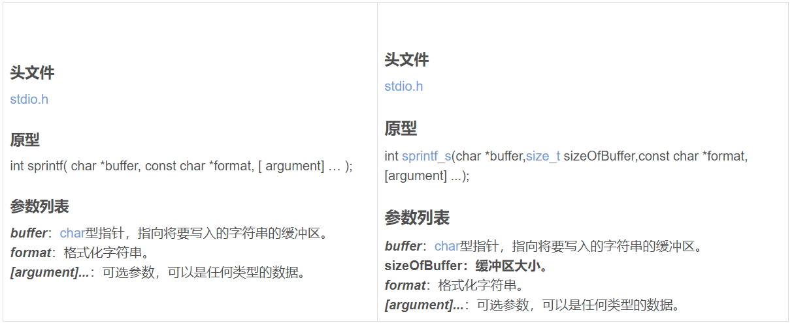

# sprintf和sprintf_s

**sprintf_s是sprintf的安全版本，指定缓冲区长度来避免sprintf()存在的溢出风险，主要差在sprintf_s第二个参数，可以控制缓冲区大小**



# 0830记录

1、git merge 的两个对象，到底是谁合并到谁

2、git merge --abort慎用

3、如果有些操作失败，退回到曾经的版本，git reflog和git reset --hard HARD

# malloc、calloc、realloc、alloca

```c
void *malloc( size_t size );
void *calloc( size_t num, size_t size );
void *realloc( void *ptr, size_t new_size );
```

calloc相比于malloc主要是，calloc在返回指向内存的指针之前把它初始化为0。另一个区别是calloc是根据元素的个数和每个元素的字节数分配内存，而malloc是直接根据内存大小分配。

realloc用于修改一个原先已经分配的内存块的大小。使用这个函数，可以使一块内存扩大或者缩小。扩大内存时，内存以前的内容不变，把新内存放在旧内存后面，并且新内存并未进行任何初始化。缩小内存时，旧内存尾部的部分被拿掉了，剩余部分的内容仍然保留。

realloc中如果原先内存无法改变大小，realloc将分配另一块正确大小的内存，并把原先那块内存的内容复制到新块上来。因此，在使用realloc之后，就不能再使用指向旧内存的指针，而是应该该用realloc所返回的新指针。最后，如果realloc函数的第一个参数是NULL，那么它的行为和malloc是一模一样的。C语言规范认为该函数行为过多，禁止使用该函数。

alloca与其他三个截然不同，alloca是在栈区分配内存的。alloca函数不需要free内存，从函数返回时是自动释放的，而且分配耗时低，但不适合大的分配。C语言规范禁止使用该函数。

# 链式队列

```c
#include<stdio.h>
#include<malloc.h>

typedef int elemtype;

typedef struct QueueNode
{
	elemtype data;//用来存放数据元素的信息
	struct QueueNode* next;
}LinkedQueueNode;

typedef struct LQueue
{
	LinkedQueueNode* front;//队头指针
	LinkedQueueNode* rear;//队尾指针
}LQueue,*LinkedQueue;//链队列结构类型

//队列的初始化
LinkedQueue Init_LinkedQueue()
{
	LinkedQueue Q = (LQueue*)malloc(sizeof(LQueue));
	LinkedQueueNode* head = (LinkedQueueNode*)malloc(sizeof(LinkedQueueNode));

	Q->front = head;
	Q->rear = head;
	head->next = NULL;
	return Q;
}

//入队
bool in_LinkedQueue(elemtype e, LinkedQueue Q)
{
	LinkedQueueNode* L = (LinkedQueueNode*)malloc(sizeof(LinkedQueueNode));
	L->data = e;
	L->next = NULL;

	Q->rear->next = L;
	Q->rear = L;
	return true;
}

//出队
bool out_LinkedQueue(LinkedQueue Q)
{
	LinkedQueueNode* node;

	if (Q->front == Q->rear)
	{
		return false;
	}

	node = Q->front->next;
	Q->front->next = node->next;

	if (node == Q->rear)
	{
		Q->rear = Q->front;
	}
	printf("%d,", node->data);
	free(node);
	return true;
}
int main()
{
	LinkedQueue Q;
	Q = Init_LinkedQueue();
	return 0;
}

```

**一个链式队列，头尾指针分别是front与rear，在进行出队操作时（），队头队尾指针会发生什么样的变化？**

队头队尾指针可能都要修改。原因：

```c
//队头指针修改是理所当然的
//主要是队尾指针的修改，当队列中只剩一个元素时，即node == Q->rear,此时rear就会指向node->next，也就是说rear会指向一个空指针。
if(node == Q->rear->next) {
    Q->rear = Q->front;
}
```

# 完全二叉树

完全二叉树是由满二叉树而引出来的，若设二叉树的`深度为h`，`除第 h 层外`，`其它各层 (1～h-1) 的结点数都达到最大个数(即1~h-1层为一个满二叉树)`，第 h 层所有的结点都连续集中在最左边，这就是完全二叉树。

> k层完全二叉树，节点最多和最少分别是多少？
>
> 最多是一个满二叉树即$2^k-1$。
>
> 最少的话$2^{k-1}-1+1$，计算方法：先计算k-1层的$2^{k-1}-1$，加上第k层中的至少一个

# 指针运算

如果想让指针`p`指向`a[1]`，则第三行是什么

```c
int a[2] = {1,2};
char *p = (char *)a;
_____?//p = p + sizeof(int);
//((int *)p)++;这个不可以，因为p的类型并没有改变，所以指针运算并不能识别到它是int*
```

# 安全风险

`path`是用户输入路径，校验前进行规范化处理。如下代码存在什么风险？（缓存区溢出）

```c
char resolvedPath[64];
char *res = realpath(path, resolvedPath);

```

# sizeof

sizeof是在编译阶段计算的。

C99进入VLA（variable length array）之后，sizeof求VLA的时候，变成一个运行时的运算符。

sizeof是可以定义数组大小。

# 软件工程

？？

+ 现代软件工程
+ 经典软件工程


# 二维数组和二级指针

## 二维数组访问方式

```c
#include <stdio.h>

int a[2][3] = {
    {1,2,3},
    {4,5,6}
};

int main()
{
    int (*p)[3] = a;
    printf("%p %p\n", p, a);
    p++;
    printf("%p %p\n", p, a[1]);//a[1] 和 &a[1] 是等价的
    printf("%d %d %d %d\n", *(*p + 0),(*p)[0], a[1][0], *(*(a + 1) + 0));//二维数组访问的几种方式, 建议看下《c和指针》157页
    printf("%d %d\n", sizeof(p), sizeof(*p));//p是一个指针，但是p解引用之后就是一个3个int大小的数组
}
```

## malloc二维数组

```c
/*方法一：利用二级指针申请一个二维数组*/
#include <stdio.h>
#include <stdlib.h>

int main()
{
    int numRowSize = 4, numColSize = 2;

    int **ans = (int **)malloc(sizeof(int *) * numRowSize);/*malloc 返回的是指向int*的指针*/
    for (int i = 0; i < numRowSize; ++i) {
        *(ans + i) = (int *)malloc(sizeof(int) * numColSize);/*malloc 返回的是指向int的指针*/
    }
    for (int i = 0; i < numRowSize; ++i) {
        for(int j = 0; j < numColSize; ++j) {
            ans[i][j] = i * j;
            printf("%d\t", ans[i][j]);
        }
        puts("\n");
    }
}
/*方法二：利用数组指针申请一个二维数组*/
#include <stdio.h>
#include <stdlib.h>

int main()
{
    int numsRow = 4, numsCol = 2;
    printf("%d\n", sizeof(int(*)[numsCol]));/*测试一下“数组指针”*/
    int (*ans)[numsCol] = (int(*)[numsCol])malloc(numsRow * sizeof(int(*)[numsCol]));
    for (int i = 0; i < numsRow; ++i) {
        for(int j = 0; j < numsCol; ++j) {
            ans[i][j] = i * j;
            printf("%d\t", ans[i][j]);
        }
        puts("\n");
    }
}
```

# typeof

从C23之后，作为C语言的标准的一部分。

```c
uint8 a_size = 0;
typeof(a_size) b;
```

## 顶层const和底层const

> ==tips : 面对一条比较复杂的指针的声明语句时，从右向左阅读有助于弄清楚它的真实含义。==
>
> ==tips : 离变量名最近的符号对变量的类型有最直接的影响==

```c
/* Preliminaries */
/* top-level const */
int *const p1; /* const靠近p1, 说明p1是一个常量，而int*确定p1是什么类型的 */
/* low-level const */
const int *p1; /* *靠近p1, 说明p1是一个指针，而const int确定p1指向的是什么类型*/
```

```c
/* routine 1 : x仅可作为右值 */
void func(const int* const x)
{
    int a = 0;
    int b = 0;
    a = *x;
    //x = &b; /* compile error, x的指向不可发生变化 */
    //*x = b; /* compile error, 函数内认为x指向的内容为常量，所以不可发生变化 */
}

/* routine 2 : x可以作为右值，*x不可作为左值，x可以作为左值 */
void func(const int *x)
{
    int a = 0;
    int b = 0;
    a = *x;
    x = &b; /* x的指向可以发生变化 */
    //*x = b; /* compile error, 函数内认为x指向的内容为常量，所以不可发生变化 */
}

/* routine 3 : x可以作为右值，*x可作为左值，x不可作为左值 */
void func(int *const x)
{
    int a = 0;
    int b = 0;
    a = *x;
    //x = &b; /* compile error, x的指向不可以发生变化 */
    *x = b; /* 函数内认为x指向的内容为变量，所以可发生变化 */
}
```

```c
/* 数组理解 */
/* 用两个const修饰表明arr永远不会发生变化 */
const char *const arr[] = {
    "apple",
    "orange"
};
```

