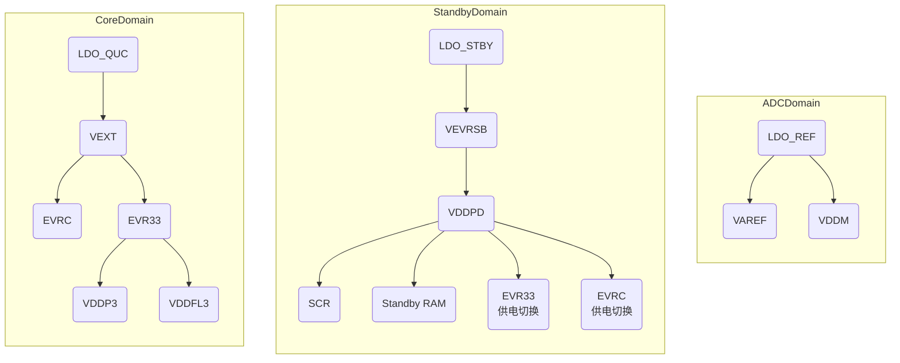

# 软件环境

## 编译

## 调试

+ 调试器：板载miniWiggler调试器

# 硬件环境

## 供电

# MBIST

1. enable SSH： the corresponding MEMx_EN in MTU_MEMTEST
2. MCi_CONFIG0/MCi_CONFIG1
3. MCONTROL.START

# Power Management System

## Application

可以作为MCU电源输入的有：

+ Vext - 可以通过内部EVR13和EVR33生成1.25和3.3V，主要使用模块all pads/ ports / OSC / HSCT
+ VDD - 提供1.25V供电（可以disable EVR13），主要使用模块CPU
+ VDDP3 - 提供3.3V供电 （可以disable EVR33），主要使用模块Flash
+ VDDM - ADC模拟供电
+ Vref - ADC参考电压 Vref <= VDDM

## Supply Mode and Generation

针对Vext/VDD/VDDP3这三路电源，MCU可以有三种supply mode:

+ single source 5v supply
+ single source 3.3v supply
+ Supplies are provided externally and the respective EVRs are in disabled state

这三种supply mode需要从硬件层面控制HWCFG引脚实现：

### 5V single supply

对于高低端型号的芯片，EVRC的实现有所不同，高端型号为SMPS（Switched-Mode Power Supply），低端型号为LDO。

### 3.3V single supply

### VEXT and VDD externally supplied

### VEXT, VDDP3 and VDD externally supplied

## Power Domain

TLF35584与TC397电源连接:

## Power Management

<table>
    <tr>
        <td>mode</td>
        <td>description</td>
        <td>entry</td>
        <td>exit</td>
    </tr>
    <tr>
    		<td>CPUx RUN</td>
        <td></td>
        <td></td>
        <td></td>
    </tr>
    <tr>
    		<td>CPUx IDLE</td>
        <td>关闭CPUx Clock，peripheral正常运行</td>
        <td>software, SMU</td>
        <td>Interrupt, Trap, Reset</td>
    </tr>
    <tr>
    		<td>system sleep</td>
        <td>所有CPU进入IDLE，外设时钟可以通过CLC配置</td>
        <td>software</td>
        <td>interrupt, trap, reset</td>
    </tr>
    <tr>
    		<td>system standby</td>
        <td>main domain掉电，standby RAM/SCR可以正常工作</td>
        <td></td>
        <td></td>        
    </tr>
</table>

### IDLE

### SLEEP

### STANDBY

core domian唤醒源：SCR / WUT / VEXT ramp-up /  Pin wake-up

## Supply Monitor

### primary

监控电源有：VEXT / VDD / VDDP3

监控机制：低电压监控，低于某个阈值就上报LVD。

+ 5v / 3.3v primary reset @ 2.97v
+ 3.3v primary reset @ 2.97v
+ 1.25v primary reset @ 1.13v

监控后处理：LVD reset（cold power-on reset）

### secondary

监控电源有：VEXT / VDD / VDDP3 / VEVRSB / VDDM / VDDPD

监控机制：电压范围监控（需配置），超过该阈值会上报smu

+ 5v / 3.3v primary reset @ 2.97v ~ SWDUVVAL  和 SWDOVVAL ~ 5.5v 
+ 3.3v secondary monitor @ 2.97v ~ EVR33UVVAL 和 EVR33OVVAL ~ 3.63v
+ 1.25v secondary monitor @ 1.125v ~ EVRCUVVAL 和 EVRCOVVAL ~ 1.375v

监控后处理：SMU alarm

### power monitor reference

SHPBG: Secondary high precision bandgap reference

PLPBG: Primary low power bandgap reference

从功能安全考虑，两个电源互检，也就是power bist, PBIST

# NVM(Non Volatile Memory)

+ Data Memory Unit(DMU)
+ Program Flash Interface(PFI)
+ Non Volatile Memory module(Flash Standard Interface(FSI) / Program and Data Flash Memories / Program Flash Read Write Buffer(PFRWB))

