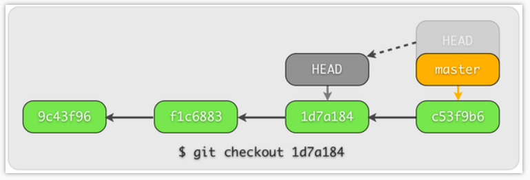

# Git指令

## Git三个工作区

**work dir区**： working directory工作目录区。也就是我们肉眼能够看到的文件。

**stage区**：暂存区。当我们在`work dir`区中执行`git add`相关命令后，就会把`work dir`中的修改添加到`stage`区

**history区**：提交历史。当`stage`中存在修改时，使用`git commit`相关命令后，就会把`stage`中的修改保存到提交历史`commit history`中，也就是`HEAD`指针指向的位置。

## Git常用指令

常用指令就围绕这个两张状态图展开：

+ 配置本地git

  `git config user.name "roboxs"`

  `git config user.email "837970950@qq.com"`

+ 初始化本地git库

  `cd 当前文件夹`

  `git init`

+ git add（别名git stage）

  将unstage状态的文件提交为stage状态

+ git log

  查看一下commit的信息

+ git diff

  不加后缀，显示unstage状态和之前commit的不同

  加上后缀`--cached`， 显示stage状态和commit的不同

  加上后缀`HEAD`，显示stage状态和unstage状态和commit的不同

+ git commit

  加后缀`-m "the first change"`，将stage状态的文件提交，变为unmodify状态

  加后缀`--amend --no-edit`，将修改的内容提交到上一次的commit中，并不增加新的commit

  加后缀`-am "the first change"`，相当于把add和commit指令合并了

+ git reset（在commit之间穿梭）

  不加后缀，将stage状态返回到modify状态

  加上后缀`--hard HEAD`，回到了最后一个commit，并且把modify的内容抛弃了

  加上后缀`--hard HEAD^或者--hard HEAD~1`,回到上上一个commit

  先`git reflog`查看一下commit变化的ID，然后加上后缀`--hard commit's ID`，回到未来的commit，对应最后一张图

  观察下面图片，更好理解回到过去的方法

  

  

  

  

+ git checkout（单个文件之间和各个分支之间切换）

  加上后缀`commitID  -- hello2.cpp`，将hello2.cpp文件切换到之前commit中的hello2.cpp文件

  加上后缀`-b dev`，建立一个名为dev的分支

  加上后缀`-b xtdrone/dev v1.11.0-beta1`，建立一个分支xtdrone/dev，并和远程分支连接起来

+ git branch

  加上后缀`dev`，添加一个分支

  机上后缀`-d dev`，删除一个分支

  切换分支指令：git checkout

  查看分支指令：git log --oneline --graph

  

+ git merge

  加后缀`--no-ff -m "keep merge info" dev`，将dev分支合并至master中，并且留下信息

## github在线管理库

1.创建一个远程的github库

2.在work dir区内远程连接到github库

`git remote add origin https://github.com/rooboxs/learning_demo.git`

3.将当前master分支推至远程库

`git push -u origin master`

4.如果需要撤回已经push 的commit

`git push origin master --force`

# Acwing Git

`git restore --staged ***.txt`将文件从暂存区返回至工作区

`git restore`工作区的内容删掉后，将暂存区的内容取出

`git rm --cache ***.txt`不去管理这个文件

git访问是使用ssh的，所以需要密钥的

切换分支是不影响暂存区的，暂存区和分支完全分离的

`git merge dev`将dev分支快速合并至master中，其实是将head指针直接指向了dev分支的最后一次commit，合并完成之后可以将dev分支删掉

分支冲突：是指master分支修改了，dev分支也修改了，合并时产生了分支冲突，需要手动去修改。

将本地的一个分支push到云端：`git push --set-upstream origin dev3`

删除云端的一个分支`git push -d origin main`

`git pull`简单的认为将云端分支拉下来并且合并，这样可以将云端修改的内容同步到本地

`git pull origin branch_name`合并云端的其他分支合并到本地当前分支

`stash`:将没有做完的内容压入栈中

