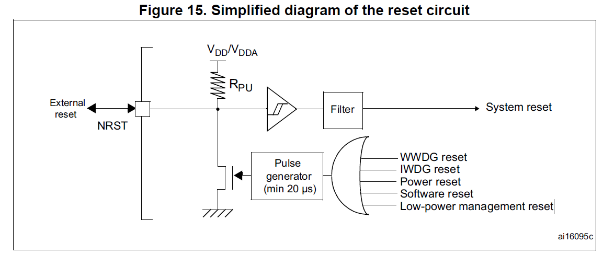
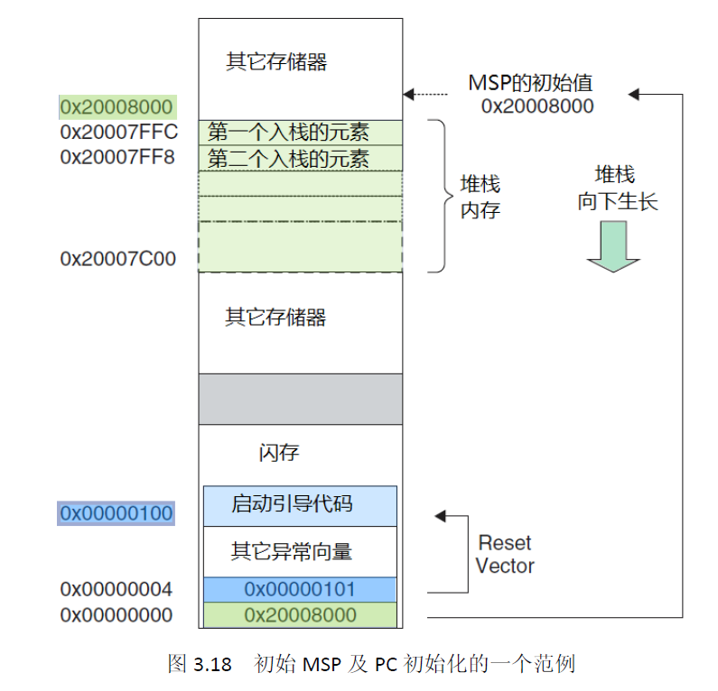
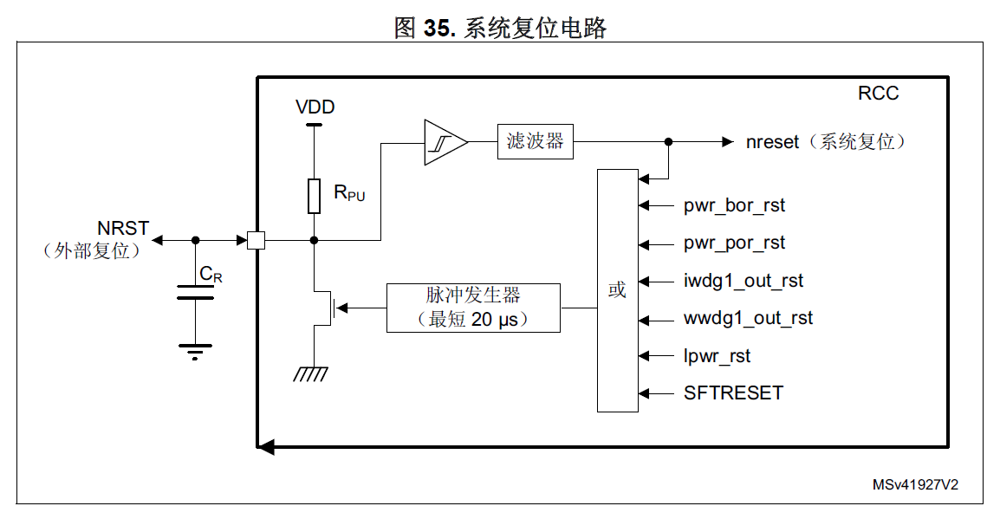
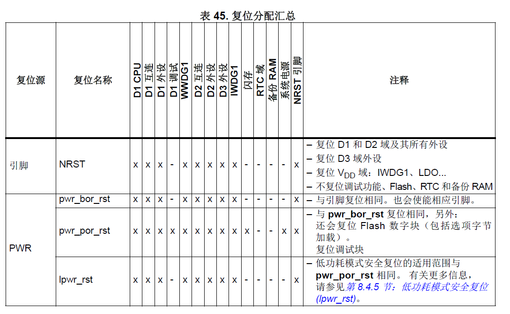
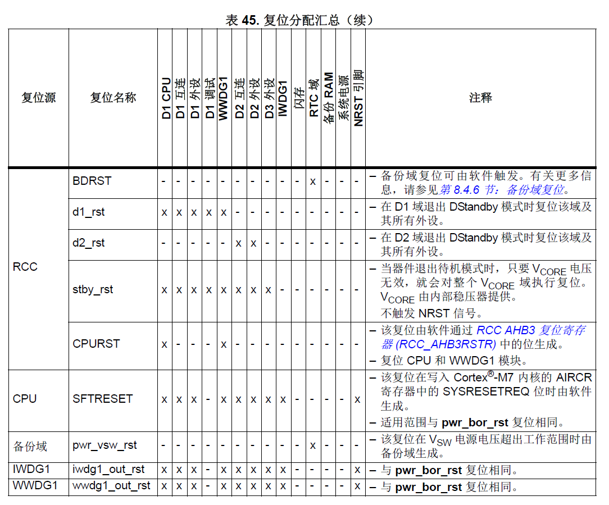

# 软复位和硬复位

软复位：CPU发出复位指令（几行代码，写寄存器），随后系统产生

# 复位

## stm32f1&stm32f4

复位系统分为上电复位、系统复位、备份域复位。最重要的是系统复位，如下图：

上电复位范围：除了备份区以外的所有寄存器。电源复位最终作用的也是RESET引脚。

系统复位范围：除了时钟控制器的RCC_CSR寄存器中的复位标志位和备份区域中的寄存器以外，将复位所有寄存器到复位状态。

==上电和系统复位之后，CPU执行的情况是什么样的呢？==

CPU的PC指针0x0000 0004处取出PC的初始值，也就是复位向量。然后从复位向量指向的地方取址执行。

## stm32H7x3

复位范围取决于复位信号源。共有三种复位类型：

+ 上电/掉电复位
+ 系统复位
+ 本地复位

复位信号源有以下几种：

+ 外部器件（通过 NRST 引脚）
+ VDD 电源电压故障
+ 看门狗超时
+ 软件命令

### 系统复位

系统复位 (nreset) 可将所有寄存器均复位为其默认值，但 RCC_RSR（或 RCC_C1_RSR） 寄存器中的复位状态标志、调试功能、Flash 和备份域寄存器除外。

### 本地复位

+ CPU复位。
+ 域复位。

### 复位源及其范围

## TC397

