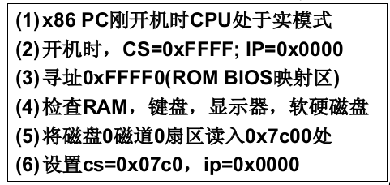
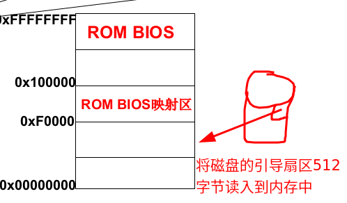
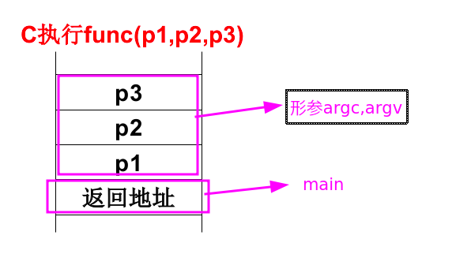
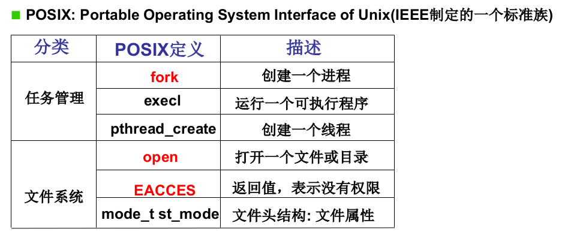
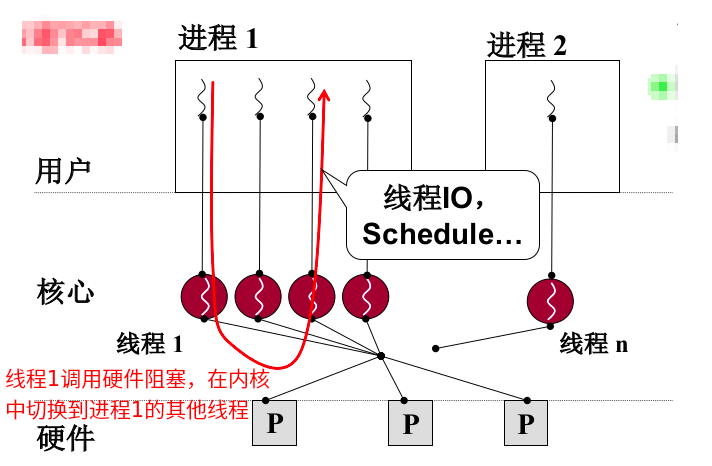
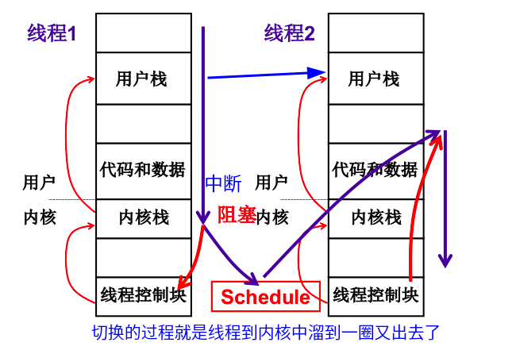
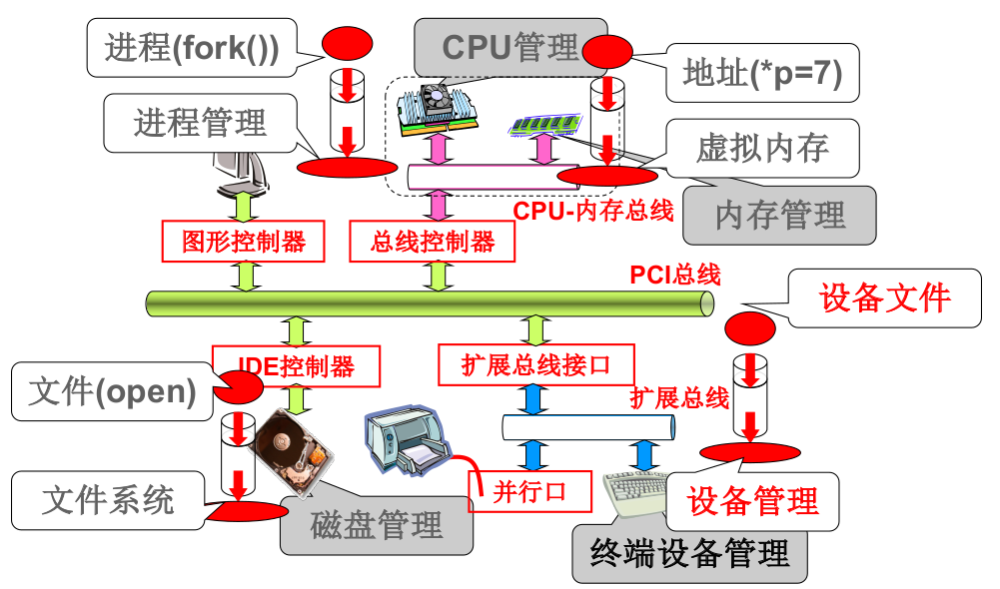
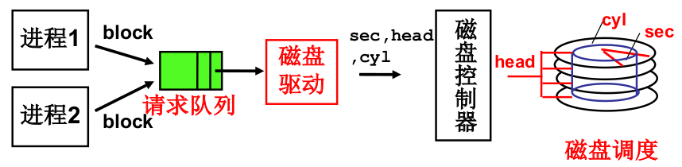

# 1.什么是操作系统

本节介绍一下操作系统的宏观轮廓。=="Learn OS concepts by coding them".==

一个实际的例子：在屏幕上输出"hello"。直接操作硬件：CPU给内存发送mov指令，内存将指定位置300的内容发送给显存。这种方式戏称为裸机。

==操作系统是计算机和应用之间的一层软件。==可以看做是给硬件穿了一层衣服。

操作系统是用来管理硬件资源，大体分为进程视图和文件视图，如下图所示：

更具体一点的：

学习本门操作系统：

==CPU管理==：

==内存管理==：

==文件管理==：

学习操作系统的层次：

1.从应用软件出发“探到操作系统”。了解并使用OS的接口。

2.从应用软件出发“进入操作系统”。学习一段文字是如何写入到磁盘上的。

3.从硬件出发“设计并实现操作系统”。给你一个板子配置操作系统。

# 2.操作系统的历史

1955-1965 IBSYS 批处理操作系统

1965-1980 OS/360 多进程结构和进程管理 

​							MULTICS  分时系统 核心是任务切换

1980-1990 UNIX

1990-2000 LINUX

PC与DOS(DISK OS)

任务：

==1.多进程图谱==:(1) CPU (2)内存

==2.文件操作视图==：IO文件，磁盘，文件怎么通过IO到达磁盘

#  3.操作系统引导

计算机工作原理：将程序放在内存(纸条)中，用IP指针(或者称为PC指针)指向每条指令，将指令传送给CPU(控制器)；==取指执行==。这里也应用了图灵机的思想。

## 3.1BIOS

从打开电源开始，我们要思考计算机执行的第一句指令是什么，也就是IP指向内存的哪里。

对于x86计算机，在打开电源之后内存中有一段是固化的，叫ROM BIOS(basis input out system)。上电之后就跳转到0XFFFF0，运行BISO。然后读入磁盘的0磁道0扇区到内存，==0磁道0扇区就是操作系统的引导扇区。==

> **tips: CS是段寄存器，IP是偏移寄存器`CS<<4+IP`。**

## 3.2bootsect

操作系统的故事是从0x7c00处开始，也就是从磁盘引导扇区读入的那512个字节。引导扇区写入了一段汇编代码叫做bootsect.s。bootsect.s的作用是读入setup模块和system模块并在屏幕中显示logo(开机时的黑色屏幕)。bootsect执行完将控制权交给setup`0x90200`。

> **tips: 一个扇区是512字节。**

上图是操作系统在磁盘中的形式。

# 4.操作系统启动

## 4.1setup模块

setup的来源：bootsect.s读入setup模块。

setup的作用：完成OS启动前的设置，比如读取硬件参数。读取硬件参数是为了方便管理它们，setup执行完之后操作系统就建立起来了。

setup的内容：读取硬件参数，将操作系统的内容全部移到0地址处。操作系统会一直停留在0地址处，最后内存的格局如下：

setup.s在退出舞台之前，通过cr0寄存器将16位(实模式)切换到32位模式(保护模式)，解析CS的方式也发生变化：==实模式下是cs左移4位+ip；保护模式下是根据cs查表+ip==。最后执行一个32位的高级汇编指令跳转到0地址处。

==保护模式下cs查表+ip的方式：==

CS此时是一个==选择子(selector)==，存放的是一个查表的下标。CS从GDT(Global Descriptor Table)表中查找出基址然后+ip偏移。当然，setup也会初始化GDT表。  

**tips: GDT是通过硬件来实现的,这样可以更快。**

==保护模式下中断处理函数入口：==

## 4.2system模块

整理上述的思路：BIOS读取0磁道0扇区的bootsect，bootsect将setup和system读进来，setup跳转到system。

### head.s

执行完bootsect和setup后就跳转到system的第一个模块叫head.s。head.s是进入32位模式的初始化，使用的32位汇编。

### main.c

执行完head.s后进入到main函数中，这种跳转方式和C语言中一个函数调用另一个函数是一样的，都是通过压栈的方式。

## 总结

操作系统启动的过程总体上来说是：将磁盘中的操作系统读入到内存中，并进行一些列的初始化。

# 5.操作系统接口

操作系统引导过程会把OS读入到内存中的0地址处，内存的格局如下：

本节的故事就是上层应用是如何穿过边界进入到操作系统。

用户使用计算机通过程序(应用软件)。具体可以分为三类：(1)命令行。(2)图形按钮。(3)应用程序。

## 什么是操作系统的接口

**操作系统的接口就是连接操作系统和应用软件，而不是直接面对用户的。**操作系统和应用软件之间是通过重要的函数（接口）连接。应用程序就是普通c代码加一些重要的函数，如下图所示：

**操作系统提供了这样重要的函数，这些函数就是操作系统的接口。**接口表现为函数调用，又由系统提供，所以称为系统调用。==操作系统接口就是系统调用(system_cell)。==

IEEE制定了操作系统的标准，不同的操作系统使用同样的标准可以让相同的应用软件在不同的操作系统上使用。

## 系统调用的实现

### 为什么需要系统调用

如果没有系统调用而是直接访问操作系统，就会有一系列的问题，比如可以看到root的密码、通过显存看到别人word里的内容，这是非常不安全的。所以，我们不能随意调用数据，不能随意的jmp；应该通过系统调用来访问内核中的数据，如下图。

### 内核态和用户态

内核程序和用户程序==隔离==。

隔离的方式：处理器的“硬件设计”区分==内核态(段)和用户态(段)==，如下图所示。

CS:IP是当前指令，使用CS的最低两位来表示当前程序执行什么态：==0是内核态，3是用户态==。根据==特权级(优先级)检查==来表示是否可以进行访问，如下图所示：

==内核态可以访问任何数据,用户态不能访问内核数据。==

### 硬件提供了“主动进入内核的方法”

==中断是进入操作系统的唯一方式。==

### 系统调用的实现细节

整理一下前面whoami()例子，现在思路就很清楚了：

# 6.进程管理

## CPU管理的直观方法

cpu的工作管理：

cpu提高利用率的方法是：多道程序，交替执行，也就是==并发执行程序==。

一个运行中的程序和放在磁盘上静态的程序是不一样的，为此引入==“进程”==的概念。

## 多进程

### 概念

==进程==：进行（执行）中的程序。注意与静态程序的区别。

多进程：多个进程推进，并发执行程序。

linux多进程图像如下，mian启动shell（window中就是桌面），shell再启动其他进程。

### 组织

多进程通过PCB（process control block）来管理，PCB是用来记录进程信息的数据结构。

多个进程放在不同的地方进行组织，比如就绪队列，磁盘等待队列等。

多进程的组织：PCB+状态+队列。进程状态图如下

### 交替

交替是多进程中的灵魂。

交替的三个部分：==队列操作+调度+切换==。

交替中的灵魂就是==进程调度==，一个深刻的话题。

调度的方式：

FIFO？显然这是一个公平的策略，没有考虑进程之间的区别。

Priority？优先级该怎么设定？可能会使某些进程饥饿。

> tips :  当等待时间给进程推进和响应带来明显影响称为进程饥饿。

### 合作

多进程之间的影响：解决的方法是多进程的地址空间分离，引出内存管理的概念。

多进程之间的合作：生产者-消费者例子。引入进程同步（合理的推进顺序）和信号量的概念。

### 总结

整体上讲解了多进程的概念以及设计的内容。具体设计的内容：

（1）操作寄存器完成切换。

（2）调度。

（3）进程同步与合作。

（4）地址映射。

操作系统的那棵树：Linux kernel source tree

## 进程切换

### 用户级线程

#### 概念

==进程的切换=资源切换（映射表）+指令执行序列切换。==

==线程的切换：只切换指令执行序列，但是不切换资源，实质就是映射表不变而PC指针变。==

线程的优点：保留了并发的优点，避免了进程切换的代价。

#### 用户线程切换

两个线程的样子：两个TCB、两个栈、切换的PC在栈中。

用户线程的切换是使用==yield==和create。先用create创造TCB和栈，然后yield切换栈。

#### 用户线程和内核线程区别

用户线程：

内核线程：

总结：内核线程的并发性更好。

### 内核级线程

==并行==：同时出发，同时执行。把每一个任务分配给每一个处理器，充分发挥多核。

==并发==：同时出发，交替执行。把任务在不同的时间点交给处理器。

多核心：多个cpu，用一套资源（映射表）。

多处理器：多个cpu，用不同的资源（映射表）。

内核级线程的切换思路：

用户级线程和内核级线程的区别：前者是两个栈切换，后者是两套栈切换。对比如下：

## 进程调度

### 策略方案

在就绪队列中有一堆进程，到底选择谁来进行。

策略1：FIFO，先入先出。比如银行、食堂。

策略2：Priority，优先级。

怎么样才能让进程满意CPU调度算法？时间

1.周转时间（从任务进入到任务结束）短

2.响应时间（从操作发生到响应）短

3.内耗时间少：吞吐量（完成的任务量）

### 如何做到合理

==需要折中，需要综合。==

**吞吐量和响应时间之间的矛盾：**

响应时间小----->切换次数多----->系统内耗大----->吞吐量小

**前台任务和后台任务的关注点不同：**

==前台任务关注响应时间，后台任务关注周转时间。==比如说中断就是前台任务，在中断中停留的时间要短；while（1）大循环这就是后台任务。

**IO约束型任务和CPU约束型任务：**

IO约束型任务，比如word，要不断输入，所以执行短CPU区间的频率就高。CPU约束型任务，比如gcc编译器，要在持续计算，所以执行长CPU区间的频率就高。因此，==IO约束型任务的优先级高，CPU约束型任务的优先级低。==

### 调度算法

+ First Come, First Served(FCFS)

+ SJF(Shortest Job First)：最短作业优先

  优点：周转时间最小。

  缺点：无法保证响应时间，长作业不断往后推，长作业长期不会被运行。

+ RR(Round Rubin)：按时间片来轮转调度

  优点：保证响应时间。

  关键点：选择时间片的长度。如果时间片设得太短会导致过多的进程上下文切换，降低了 CPU 效率；如果设得太长又可能引起对短作业进程的响应时间变长。将通常时间片设为 `20ms~50ms` 通常是一个比较合理的折中值。

+ HPF(Highest priority first)：最高优先级调度。

  **动态优先级**：创建进程时候，就已经确定了优先级了，然后整个运行时间优先级都不会变化；

  **静态优先级**：根据进程的动态变化调整优先级，比如如果进程运行时间增加，则降低其优先级，如果进程等待时间（就绪队列的等待时间）增加，则升高其优先级，也就是**随着时间的推移增加等待进程的优先级**。

  **非抢占式**：当就绪队列中出现优先级高的进程，运行完当前进程，再选择优先级高的进程。

  **抢占式**：当就绪队列中出现优先级高的进程，当前进程挂起，调度优先级高的进程行。

  缺点：可能会导致低优先级的进程永远不会进行。

### schedule函数

主要使用了counter变量，它有两个作用：

+ 优先级：

  counter代表的优先级可以动态调整，阻塞的进程时间越长则优先级有越高。照顾了前台进程。

+ 时间片：

  后台进程一直按照counter轮转，近似了SJF调度。

  保证响应时间有界。根据$c(0)=p, c(t)=c(t-1)/2+p$，则有$c(\infty)=2p$，阻塞的进程最大的时间片也才能增加到原来的2倍。

## 进程同步

### 进程同步与信号量

#### 从信号到信号量

信号只能表达0和1，因此引入信号量的概念。记录一些信息（量），并根据这个信息决定睡眠还是唤醒（信号）。**从信号到信号量表达了更丰富的信息。**

**信号量就是一个整型变量。**

根据信号量的值可以判断什么时候走（正的），什么时候等（负的）。

多个进程之间的同步，就是让“进程走走停停”来保证多进程合作的合理有序。

#### 用信号量解决生产者-消费者问题

### 信号量临界区保护

#### 临界区

竞争条件：和调度有关的共享数据语义错误。错误由多个进程并发操作共享数据引起的。

解决竞争条件的直观想法：**在写共享变量时阻止其他进程访问共享变量。**引入“临界区”的概念。

**==临界区：==一次只允许一个进程进入的该进程的那段代码。**进程代码结构如下：

临界区代码的保护原则：

+ 基本原则：互斥进入

+ 有空让进：若干进程要求进入空闲临界区时，应尽快使一进程进入临界区
+ 有限等待：从进程发出进入请求到允许进入，不能无限等待

#### 进入临界区的方法

+ 软件法

  + 轮换法（值日）

    满足互斥进入。某一进程阻塞时，不满足有空让进。

  + 标记法

    满足互斥进入。不满足有空让进。

  + 非对称标记

  + Peterson算法（标记+轮转）

    满足互斥进入，满足有空让进，满足有限等待。用于两个进程。

  + 面包店算法（标记+轮转）

    满足互斥进入，满足有空让进，满足有限等待。用于两个进程。

+ 硬件法

  + 开关中断

    **发生语义错误的最本质的原因是调度，只要阻止调度就可以进行原子操作**，那么调度产生的根本原因是发生中断，因此只要关掉中断就可以。

    例如，在执行empty--的三条汇编指令时，时间片不够了，产生了时钟中断。此时cli()关掉中断即可。

    缺点：多cpu不好使，没法同时关掉所有cpu的时钟中断。

  + **硬件原子指令法**

    使用硬件实现了一个类似1的锁信号量，这种锁信号量不会被打断，**可以视为一条指令（原子指令）**。

#### 总结

临界区保护信号量，信号量实现同步，这就是进程合作（同步）的完整事情。

**互斥**：上面展示的情况称为竞争条件，当多进程相互竞争操作共享变量时，错误由多个进程并发操作共享数据引起的。事实上，每次运行都可能得到不同的结果，因此输出的结果存在不确定性。

**临界区**：一次只允许一个进程进入的该进程的那段代码。

**同步**，就是并发进程/线程在一些关键点上可能需要互相等待与互通消息，这种相互制约的等待与互通信息称为进程/线程同步。

**锁**：使用加锁操作和解锁操作可以解决并发线程/进程的互斥问题。

**信号量**：信号量是操作系统提供的一种协调共享资源访问的方法。

### 死锁处理

#### 概念

**死锁**：多个进程由于互相等待对方持有的资源而造成的谁都无法执行的情况叫死锁。

死锁造成的结果：越来越多的进程阻塞，很多进程都没法执行，CPU都没干正经活，CPU利用率很低。

#### 死锁的成因

死锁的必要条件：

+ 互斥使用

  如果线程 A 已经持有的资源，不能再同时被线程 B 持有，如果线程 B 请求获取线程 A 已经占用的资源，那线程 B 只能等待，直到线程 A 释放了资源。

+ 不可抢占

  当线程已经持有了资源 ，在自己使用完之前不能被其他线程获取，线程 B 如果也想使用此资源，则只能在线程 A 使用完并释放后才能获取。

+ 请求和保持

  当线程 A 已经持有了资源 1，又想申请资源 2，而资源 2 已经被线程 C 持有了，所以线程 A 就会处于等待状态，但是线程 A 在等待资源 2 的同时并不会释放自己已经持有的资源 1。

+ 循环等待

  在死锁发生的时候，两个线程获取资源的顺序构成了环形链。

#### 死锁处理方法

+ 死锁预防

  破坏死锁出现的条件。

  例如，“no smoking”。

+ 死锁避免

  检测每个资源请求，如果会造成死锁就拒绝。

  例如，检测煤气超标时，自动切换电源。

  具体方法：找到一个可以完成的序列P1，P2......,Pn，则称系统处于安全状态。找安全序列的银行家算法（Dijkstra）。缺点是时间复杂度高，执行代价大。

+ 死锁检测+恢复

  检测到死锁的时候，让一些进程回滚，让出资源。

  例如发现火灾时，立刻拿起灭火器。

  具体方法：定时检测或者发现资源利用率低时检测（调用银行家算法）。

+ 死锁忽略

  就好像没有死锁一样。

  例如，在太阳上可以对火灾全然不顾。**PC机上安装的windows和linux，都采用死锁忽略方法，因为死锁可以使用重启来解决，死锁预防让编程变得困难，死锁忽略代价小，而且死锁是小概率事件。**

# 7.内存管理

## 内存使用Memory

回顾一下冯诺依曼计算机的核心：取指（内存），执行（CPU）。

==重定位==：修改程序中的逻辑地址（相对地址）三种方法：

+ 编译时
+ 载入时
+ **运行时（用这种）**

**内存使用过程**：将静态程序载入内存中时，建立包含进程基地址的PCB，运行时根据**物理地址=逻辑地址（相对地址）+基地址**进行重定位。当进程进行切换时，PCB也跟着进行切换。

## 分段Segmentation

 程序有若干段组成，每个段有各自的特点、用途：代码段只读，代码/数据段不会动态增长等。

因此，定位具体指令就变为：<段号，段内偏移>。

程序载入内存时，将每个段的基址放在LDT表中。==操作系统的段表叫GDT+进程的段表是LDT。==

## 内存分区和分页Memory Partition and Paging

程序载入内存的三个步骤：

1.将程序分为多个段，编译阶段。

2.划分空闲区域，内存分区。

3.通过磁盘读写将程序载入到内存中，设备驱动。建立LDT表与PCB关联起来。

### 内存分区

可变分区，根据需求分区。内存分区根据段的请求进行可变分区。适配请求分区大小的方法：

+ 首先适配

  空闲分区表中的第一个。

+ 最佳适配

  空闲分区表中适合自己的最小的。

+ 最差适配

  空闲分区表中最大的。

### 分页

可变分区造成的问题：**内存碎片**。因此，需要将空闲分区合并，内存紧缩，但需要花费大量的时间。因此，该方法不可行。引入“分页”的概念，解决内存分区导致内存效率的问题。

从连续到离散。

针对每个段内存请求，系统一页一页的分配给这个段。==物理内存希望分页，用户写程序希望分段。==

MMU硬件电路根据逻辑地址自动将页号和页内偏移地址计算出来，然后根据**页表**计算出物理地址。

### 多级页表

为了提高内存空间利用率，页应该小，但是页小了页表就大，内存中存储页表就有问题了。

尝试一：只存放用到的逻辑页，但是页表中的页号不连续，需要查找比较，那么访问内存的次数就会增加log(n)次（二分查找）。

尝试二：多级页表。页目录号连续，并且不需要的页目录号的页号可以不存放在内存中，每增加一级访问内存次数增加一次。对于32位系统只增加了一次，对于64位系统增加的不止一次。

### TLB

为了解决多级页表增加访存次数的问题，特别是64位系统，引入TLB概念。TLB可以提高时间效率。

**CPU中有一个专门存放程序最常访问的页表项的 Cache，这个Cache就是TLB（Translation Lookaside Buffer)，通常称为快表、页表缓存、转址旁路缓存等。**

有了TLB后，那么CPU在寻址时，会先查TLB，如果没找到，才会继续查多级页表。快表+多级页表配合如下：

TLB能够发挥作用的原因：**程序的地址访问存在局部性。**程序多体现为循环、顺序结构。

## 段页结合的实际内存管理Segmentation&Paging

==段面向用户，页面向硬件。==

用户表面上操作虚拟地址，实际上操作系统将虚拟地址中的段打碎一片一片地存入内存中。

## 内存换   入-请求调页Swap in

虚拟内存大，但是物理内存小，用换入、换出实现“大内存”。

发生缺页时，产生缺页中断，调用页错误处理程序，在处理程序中将磁盘中的页读入到内存中，这就是**内存换入-请求调页**。

## 内存换出Swap out

有换入就应该有换出，不然内存就溢出了。

需要选择页淘汰，换出到磁盘，选择哪一页呢？

### 内存页面置换算法

例子：假设分配了3个**页框(frame)**，页面引用序列为A B C A B D A D B C B。分析下面三种页面置换算法。

+ FIFO页面置换

  

  评价准则 : **缺页次数**；本实例, FIFO 导致 7 次缺页。

+ MIN页面置换

  

  本实例, MIN 导致 5 次缺页。

  选最远将使用的页淘汰，这是最优的。但并不知道程序将来要执行哪一页。

+ LRU(Least Recently Used)页面置换

  

  本实例, LRU 也导致 5 次缺页。LRU是公认的很好的页面置换算法。

  **根据程序局部性原理，用过去的历史预测未来。**选最近最长一段时间没有使用的页淘汰（最近最少使用）。

### LRU实现

#### LRU准确实现

+ 维护时间戳

  每执行一条指令，都需要修改时间戳，代价太大。

+ 页码栈

#### LRU近似实现

最近最少使用----------->最近是否使用

+ SCR(Second Chance Replacement)

  

  记录太多的历史信息，如果所有R=1，则退化为FIFO。

+ CLock算法

  

  为了体现“最近”概念，拆分为扫描指针（定期扫描，只清零不换出）和换出指针（只换出，不清零）。

  + 引入扫描指针，移动速度快，定时将所有页面的R位清零。
  + 发生缺页时，换出指针扫描页面，移动速度慢。如果R位为零，淘汰该页。

### 页框

每个进程分配一个固定大小的**页框(frame)**，然后Clock算法形成一个环形数组。

理论上一个页框的大小应该能够覆盖一个进程的局部，但是局部的大小很难算。

**系统颠簸：**

解释：系统内进程增多每个进程$\Rightarrow$每个进程的缺页率增大$\Rightarrow$缺页率增大到一定程度，进程总等待调页完成$\Rightarrow$CPU利用率降低$\Rightarrow$进程进一步增多，缺页率更大。

##　总结

物理内存使用分页。

+ 程序所使用的内存地址叫做**虚拟内存地址**。
+ 实际存在硬件里面的空间地址叫**物理内存地址**。
+ swap分区：在系统的物理内存不够用的时候，把硬盘内存中的一部分空间释放出来，以供当前运行的程序使用。

# 8.设备管理

设备管理包括终端设备管理和磁盘管理。

## 终端管理

终端设备包括显示器和键盘。终端设备的工作过程：

### 总结

+ 缓冲区：CPU和内存的速度比较快，但是往设备上写内容时比较慢，所以先写到缓冲区中，设备消费缓冲区。

## 磁盘管理

### 生磁盘使用raw-disk

#### 通过盘块号读写磁盘（一层抽象）

#### 多个进程通过队列使用磁盘（二层抽象）

磁盘调度算法：

+ FCFS先来先服务

+ SSTF（Shortest-seek-time First）短寻道优先

  某些进程饥饿，磁头在小区域内来回移动。

+ SCAN

  SSTF+中途不回折：每个请求都有处理机会。

+ C-SCAN（电梯算法）

  SCAN+ 直接移到另一端:两端请求都能很快处理。

### 从磁盘到文件cooked-disk

如何从文件得到block号？当然是映射关系。

#### 在盘块上引入更高一层次的抽象概念--文件（三层抽象）

用户眼中的文件是字符流，磁盘上的文件是什么样？

建立字符流算出盘块集合的映射关系。操作系统维护这个映射。

FCB(File Control Block)存放起始块和文件占的块数。

#### 磁盘中的文件存储结构

+ 连续结构（数组）

  动态增长比较麻烦，读写比较快。比如，词典。

+ 链式结构（链表）

  适合动态增长，读写比较慢。比如，word。

+ 索引结构

  FCB存储索引块。实际系统是多级索引（有点像目录）。

### 目录与文件

#### 文件系统，抽象整个磁盘（第四层抽象）

从上往下：从文件树到磁盘，就是找到文件对应的盘块。

从下往上：可以将磁盘插到其他计算机上，通过应用结构+存储的数据得到那棵文件树。

+ 目录树

  k次划分后，每个集合中文件数为O($\log_kN$)

磁盘可以自举（像操作系统引导一样），磁盘格式化后一定可以找到根目录 \，通过根目录就可以自举。

### 总结

“完成全部映射下”的磁盘使用：

